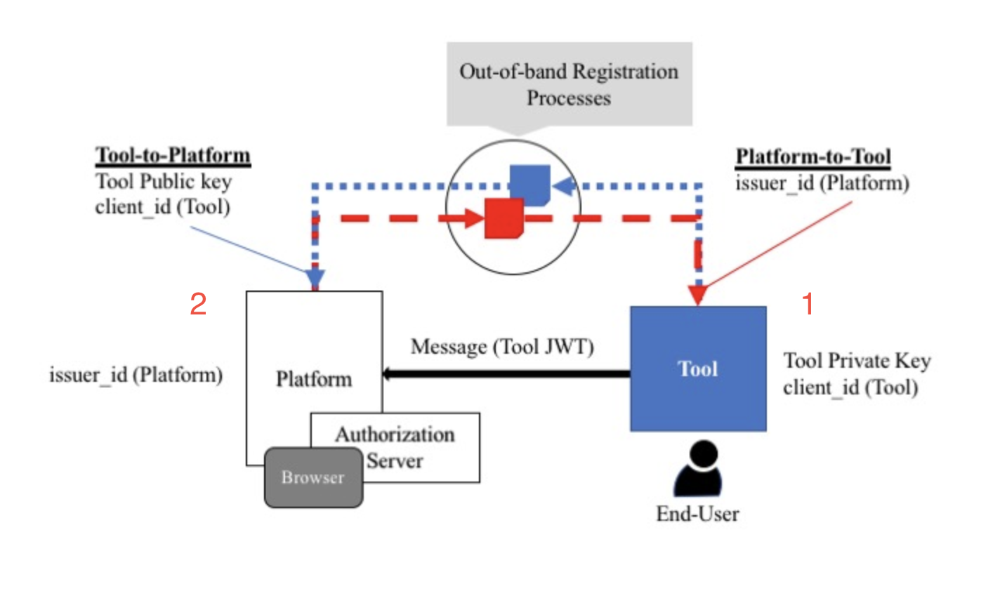

# LTI resource link launch process with OIDC

> How to [perform secured tool originating messages](https://www.imsglobal.org/spec/security/v1p0/#tool-originating-messages).

## Flow



To handle the OIDC flow for an LTI resource link launch request, each step will be detailed below, from both platform and tool perspectives.

## Table of contents

- [1 - Tool side: launch generation](#1---tool-side-launch-generation)
- [2 - Platform side: launch validation](#2---platform-side-launch-validation)

## 1 - Tool side: launch generation

You can find below required steps to generate a tool originating message, needed only if you're acting as a tool.

### Create the launch

As a tool, you can create a tool originating message for a platform within the context of a registration.

To do so, you can use the [ToolOriginatingLaunchBuilder](../../src/Message/Launch/Builder/ToolOriginatingLaunchBuilder.php):
```php
<?php

use OAT\Library\Lti1p3Core\Message\Launch\Builder\ToolOriginatingLaunchBuilder;
use OAT\Library\Lti1p3Core\Message\LtiMessageInterface;
use OAT\Library\Lti1p3Core\Message\Payload\Claim\DeepLinkingContentItemsClaim;
use OAT\Library\Lti1p3Core\Registration\RegistrationRepositoryInterface;

// Create a builder instance
$builder = new ToolOriginatingLaunchBuilder();

// Get related registration of the launch
/** @var RegistrationRepositoryInterface $registrationRepository */
$registration = $registrationRepository->find(...);

// Build a launch request
$message = $builder->buildToolOriginatingLaunch(
    $registration,                                               // related registration
    LtiMessageInterface::LTI_MESSAGE_TYPE_DEEP_LINKING_RESPONSE, // message type of the launch
    'http://platform.com/launch',                                // platform launch url
    null,                                                        // will use the registration default deployment id, but you can pass a specific one
    [
        new DeepLinkingContentItemsClaim(...),                   // LTI claim representing the DeepLinking returned resources 
        'myCustomClaim' => 'myCustomValue'                       // custom claim
    ]
);
```
**Note**: like the `DeepLinkingContentItemsClaim` class, any claim that implement the [MessagePayloadClaimInterface](../../src/Message/Payload/Claim/MessagePayloadClaimInterface.php) will be automatically normalized and added to the message payload claims.

### Use the launch

As a result of the build, you get a [LtiMessageInterface](../../src/Message/LtiMessageInterface.php) instance that has to be used this way (form POST into `JWT` parameter):
```php
<?php

use OAT\Library\Lti1p3Core\Message\LtiMessageInterface;

// Auto redirection from the tool to the platform via the user's browser
/** @var LtiMessageInterface $message */
echo $message->toHtmlRedirectForm();
```

## 2 - Platform side: launch validation

You can find below required steps to validate a tool originating message, needed only if you're acting as a platform.

### Validate the launch

As a platform, you'll receive an HTTP request containing the launch message.

The [PlatformLaunchValidator](../../src/Message/Launch/Validator/PlatformLaunchValidator.php) can be used for this:
- it requires a registration repository and a nonce repository implementations [as explained here](../quickstart/interfaces.md)
- it expects a [PSR7 ServerRequestInterface](https://www.php-fig.org/psr/psr-7/#321-psrhttpmessageserverrequestinterface) to validate
- it will output a [LaunchValidationResult](../../src/Message/Launch/Validator/Result/LaunchValidationResult.php) representing the launch validation, the related registration and the message payload itself.

For example:
```php
<?php

use OAT\Library\Lti1p3Core\Message\Launch\Validator\PlatformLaunchValidator;
use OAT\Library\Lti1p3Core\Registration\RegistrationRepositoryInterface;
use OAT\Library\Lti1p3Core\Security\Nonce\NonceRepositoryInterface;
use Psr\Http\Message\ServerRequestInterface;

/** @var RegistrationRepositoryInterface $registrationRepository */
$registrationRepository = ...

/** @var NonceRepositoryInterface $nonceRepository */
$nonceRepository = ...

/** @var ServerRequestInterface $request */
$request = ...

// Create the validator
$validator = new PlatformLaunchValidator($registrationRepository, $nonceRepository);

// Perform validation
$result = $validator->validateToolOriginatingLaunch($request);

// Result exploitation
if (!$result->hasError()) {
    // You have access to related registration (to spare queries)
    echo $result->getRegistration()->getIdentifier();

    // And to the LTI message payload (JWT parameter)
    echo $result->getPayload()->getVersion();               // '1.3.0'
    echo $result->getPayload()->getMessageType();           // 'LtiDeepLinkingResponse'
    echo $result->getPayload()->getClaim('myCustomClaim');  // 'myCustomValue'

    // If needed, you can also access the validation successes
    foreach ($result->getSuccesses() as $success) {
        echo $success;
    }
} 
```
